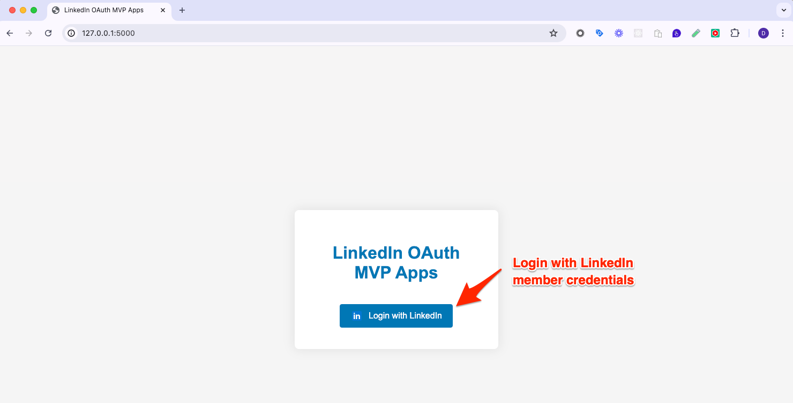
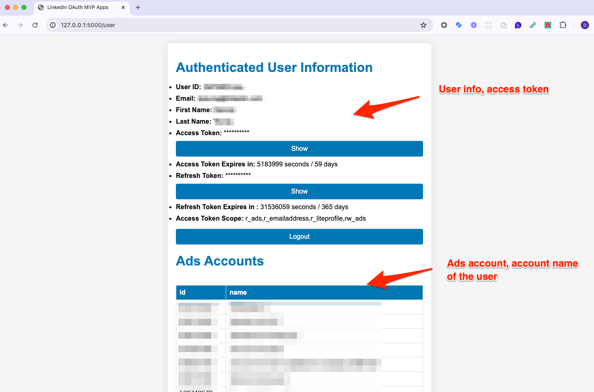

# LinkedIn Sample OAuth Apps (MVP)

## Introduction

This project sets up a basic Python Flask web application that allows users to log in using their LinkedIn member account through [OAuth 2.0 3-legged code flow](https://learn.microsoft.com/en-gb/linkedin/shared/authentication/authorization-code-flow?context=linkedin%2Fcontext&tabs=HTTPS1), retrieves authenticated user information and ads accounts.

MVP is meant to be a Minimum Viable Product (MVP) to validate a business idea with minimal resources and effort by releasing a basic version of the product that includes only the essential features (OAuth 2.0 workflow).

Developer is welcome to build on top of it to add more functionality and polish the user experience, or integrating into existing workflow.

## Pre-requistie

1. Create an app from [LinkedIn developer portal](https://developer.linkedin.com)
2. Make sure the app have added the required product. If it doesn't please request access. 
3. Assume all the above requirements are met, developer should be able to spin up a MVP apps in 5 minutes.

## How to run

1. Clone repository locally to your machine

   `git clone https://github.com/otyeung/linkedin-sample-oauth-apps`

2. Create virtual environment

   `python -m venv venv`

3. Activate virtual environment
   `source venv/bin/activate`

4. Install required Python library in virtual environment
   `pip install -r requirements.txt`

5. Copy your client id, client secret from developer portal to .env file. You should set the API_VERSION to the latest one according to [LinkedIn API documentation](https://learn.microsoft.com/en-us/linkedin/marketing/versioning?view=li-lms-2024-06) in the format "YYYYMM", it should NOT be older than 12 months from current date. Just put it in HTTP header "Linkedin-Version".

6. Provision redirect_url (http://127.0.0.1:5000/login/authorized) in the apps under LinkedIn developer portal. This is NECESSARY to complete the OAuth 3-legged redirect flow.
   

7. Run flask app by
   `flask --app sample run`

8. Open Chrome web browser in incognito window (or clear all caches and cookies from linkedin.com, www.linkedin.com, 127.0.0.1)
   `http://127.0.0.1:5000/`

The apps will print the current user information and ads accounts in browser upon successful authentication.

## Limitations and Further Enhancements

1. To further enhance the apps, developer may persist the access token in the apps and implement [token refresh](https://learn.microsoft.com/en-gb/linkedin/shared/authentication/authorization-code-flow?context=linkedin%2Fcontext&tabs=HTTPS1#step-5-refresh-access-token) routine before existing access token expires
2. Developer may try other APIs to [search Ads accounts](https://learn.microsoft.com/en-gb/linkedin/marketing/integrations/ads/account-structure/create-and-manage-accounts?view=li-lms-2024-06&tabs=http#search-for-accounts), [search campaigns](https://learn.microsoft.com/en-gb/linkedin/marketing/integrations/ads/account-structure/create-and-manage-campaigns?view=li-lms-2024-06&tabs=http#search-for-campaigns), etc with the acquired access token. Remember to add the required scople in access token.

## Troubleshooting

1. If developer run into api error, please clear all caches/cookies in current window or launch a new incognito window.
2. If developer find a bug, please submit new issue in github.

## MVP Screenshots

